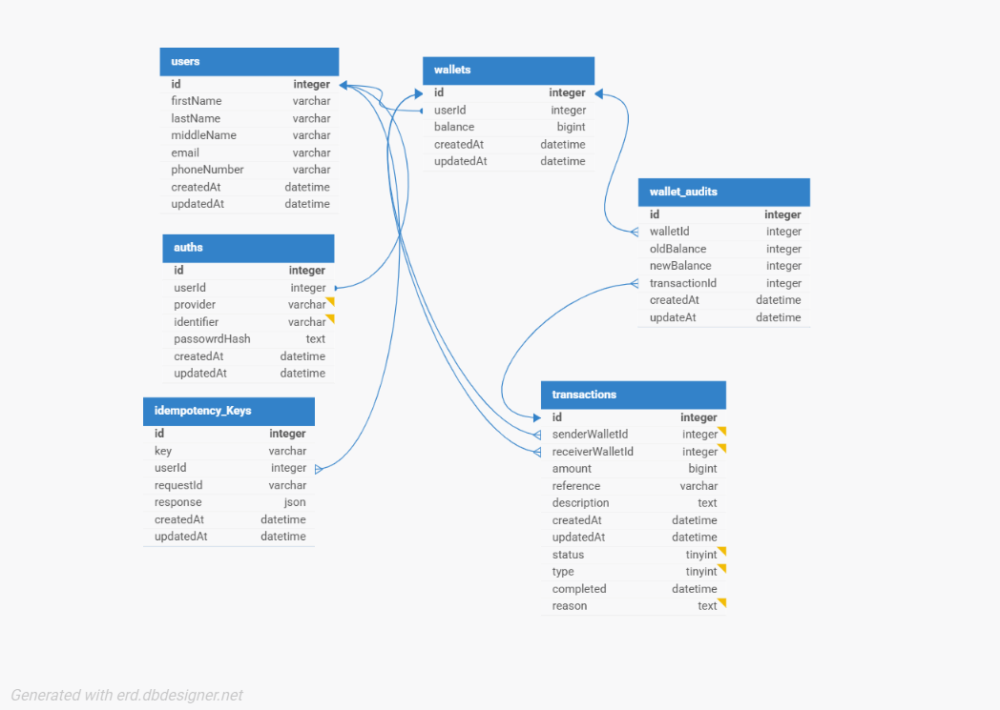

# Demo Credit Wallet Service

## Overview

This is an MVP wallet service for Demo Credit, a mobile lending app, built with NodeJS, TypeScript, MySQL, KnexJS, Redis, Tyringe, and Bull. It supports user account creation, wallet funding, transfers (queued for processing), withdrawals, and transaction history with cursor-based pagination, integrating with Lendsqr Adjutor for KYC blacklist checks.

## Tech Stack

- NodeJS (LTS): Backend runtime
- TypeScript: Type safety
- MySQL: Relational database
- KnexJS: ORM for database operations
- Redis: Idempotency and queueing (via Bull)
- Tyringe: Dependency injection
- Bull: Queueing for transfer processing
- Express: API framework
- Jest: Unit testing

## Requirements

Node.js >= 22.17.x  
npm or yarn  
MySQL Server  
Redis Server (for Bull queue)

## Clone & Install

git clone https://github.com/yousouf9/lendsqr-demo-credit.git  
cd lendsqr-demo-credit  
npm install

## Environment Setup

### Create a .env file in the root directory. Here's a sample:

```bash
NODE_ENV=development
JWT_SECRET=secre
JWT_EXPIRY_TIME=15m
DB_CLIENT=mysql2
DB_HOST=host
DB_USER=root
DB_PASSWORD=password
DB_NAME=db_nam
DB_PORT=port
REDIS_HOST=localhost
REDIS_PORT=6379
REDIS_USERNAME=""
REDIS_PASSWORD=""
ADJUTOR_API_KEY=<your-adjutor-key>
ADJUTOR_API_URL=<adjutor-base-url>
VALIDATION_VENDOR=karma

---

Run migrations: npm run migrate

---

### Testing

Run: npm run test
```

### Deployment

Deployed on render: https://yusuf-ibrahim-lendsqr-be-test.onrender.com

## Database Design

### The schema ensures ACID compliance and concurrency control:

- Users: Stores user details.
- Wallets: Manages balances in kobo with table row locking for concurrency.
- Transactions: Records fund, transfer, and withdrawal transactions.
- Idempotency_Keys: Prevents duplicate requests using Redis.
- Wallet_Audits: Logs balance changes.
- Auths: Stores user login details

### ER Diagram



For full database schema and table definitions, [see here](./docs/db.md).

---

## Architecture

### Project Structure

For detailed explanation on key modules and responsibilities, [see here](./docs/project-structure.md).

### SOLID Principles:

- SRP: Each class handles one responsibility.
- OCP: Interfaces allow extension.
- LSP: Repositories implement interfaces consistently.
- ISP: Specific interfaces for each repository/service.
- DIP: tyringe for dependency injection.

Concurrency Control: Uses SELECT ... FOR UPDATE.
Queueing: Transfers are queued with Bull for asynchronous processing.
ORM Flexibility: Abstract repositories enable easy ORM switching.
Idempotency: Redis and database ensure duplicate request prevention.

## API Documentation

You can explore the full API using Postman:
[Download Postman Collection](./docs/demo-credit.postman_collection.json)

### Pagination

Cursor-Based: Uses a composite cursor (createdAt and id) to handle timestamp collisions, ensuring accurate and stable pagination for transaction history.

Implementation: Transactions are ordered by createdAt DESC, id DESC, with cursors encoded as Base64 strings for API compatibility.

## Concurrency and Queueing

- Concurrency: Uses database locks (FOR UPDATE).
- Queueing: Transfers are processed asynchronously via Bull, ensuring sequential processing and retry on failure.

## Decisions

- Bull Queue: Ensures reliable transfer processing with retries.
- Tyringe: Enhances modularity and testability.
- Optimistic Locking: Prevents concurrency issues efficiently.
- Redis: Used for idempotency and queueing to reduce database load.

## Future Improvements

- Add rate limiting.
- Enhance monitoring for queue performance.
- add a health checker
- add swagger docs support directly on the app
- add integration test

## Video Review

watch video for more clarity [click here](./docs/db.md)
